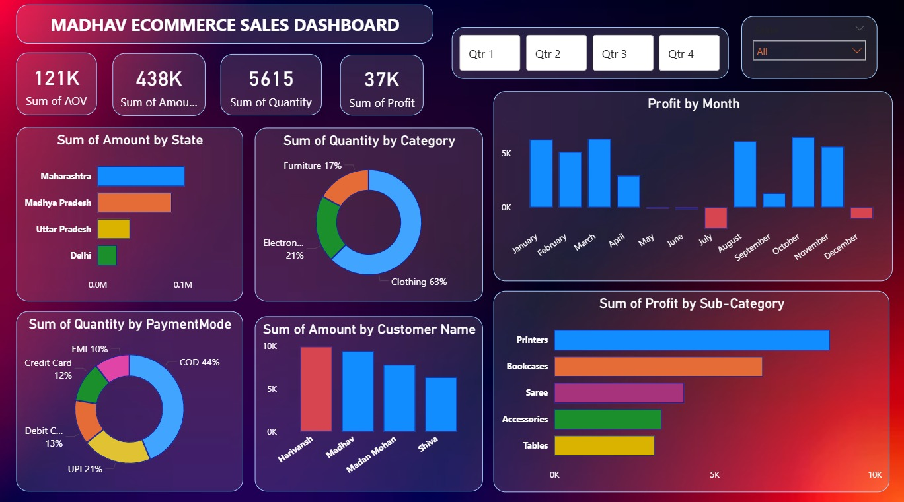

# 📊 Madhav Ecommerce Sales Dashboard – Power BI

This repository contains the Power BI Desktop (.pbix) file for the **Madhav Ecommerce Sales Dashboard**, a comprehensive analytical report designed to track and analyze sales, profit, customer behavior, category-wise performance, and monthly trends for an ecommerce business.

---

## 📈 Dashboard Highlights

The dashboard provides deep insights into multiple business KPIs, including:

### 🔹 **Key Performance Indicators (KPIs)**
- **121K** – Average Order Value (AOV)
- **438K** – Total Sales Amount
- **5615** – Total Quantity Sold
- **37K** – Total Profit Generated

---

## 📊 Visual Insights Included

### **1. Sales & Profit Analysis**
- **Profit by Month** – Monthly trend showing best- and worst-performing months.
- **Profit by Sub-Category** – Identifies top profitable product segments like:
  - Printers  
  - Bookcases  
  - Saree  
  - Accessories  
  - Tables  

### **2. Customer Insights**
- **Amount by Customer Name** – Highlights high-value customers such as Harivansh, Madhav, Madan Mohan, and Shiva.

### **3. Product & Category Insights**
- **Quantity by Category** – Clothing, Electronics, Furniture.
- **Quantity by Payment Mode** – COD, Credit Card, Debit Card, UPI, EMI.

### **4. Geographic Insights**
- **Amount by State** – Maharashtra, Madhya Pradesh, Uttar Pradesh, Delhi.

### **5. Interactive Filters**
- Quarter-wise filter (Q1, Q2, Q3, Q4)  
- Category filter (All / specific categories)

---

## 📁 Files in This Repository
- **Madhav_Ecommerce_Sales_Dashboard.pbix** – Power BI Desktop file

---

## 🖼 Dashboard Preview

---

## 🚀 How to Use
1. Download the `.pbix` file from this repository  
2. Open it using **Power BI Desktop**  
3. Explore, modify, or extend the analysis

---

## 📬 Contact
If you have any questions or would like to collaborate, feel free to reach out!

